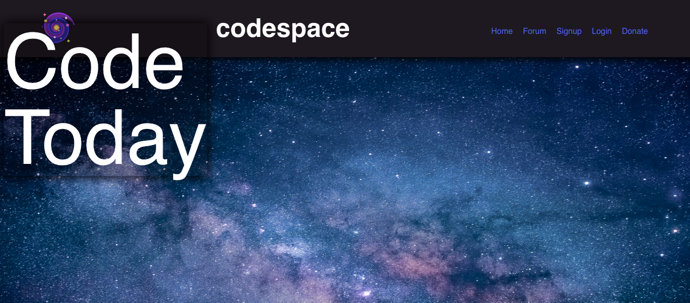

<h1 align="center" id="title">Codespace</h1>

<p id="description">Codespace is a social media platform made exclusively for coders. Upon creating an account, users are able to create events, save events to their profile, and make posts to share anything on their mind!</p>

<h2>🚀 Usage</h2>

Access the deployed application [here.](https://codespace-ch-1815939b5de1.herokuapp.com/)



<h2>🛠️ Installation</h2>

The code may be accessed on [GitHub](https://github.com/Jako0320/codespace). 

Clone the repo:
```
git clone git@github.com:Jako0320/codespace.git
```

<h2>💻 Built with</h2>

Technologies used in this application:

*   React Bootstrap
*   Node.js
*   GraphQL
*   Express.js
*   MongoDB
*   Mongoose ODM

<h2>🛡️ License:</h2>

This project is licensed under the MIT License Copyright (c) 2023 Permission is hereby granted free of charge to any person obtaining a copy of this software and associated documentation files (the "Software") to deal in the Software without restriction including without limitation the rights to use copy modify merge publish distribute sublicense and/or sell copies of the Software and to permit persons to whom the Software is furnished to do so subject to the following conditions: The above copyright notice and this permission notice shall be included in all copies or substantial portions of the Software. THE SOFTWARE IS PROVIDED "AS IS" WITHOUT WARRANTY OF ANY KIND EXPRESS OR IMPLIED INCLUDING BUT NOT LIMITED TO THE WARRANTIES OF MERCHANTABILITY FITNESS FOR A PARTICULAR PURPOSE AND NONINFRINGEMENT. IN NO EVENT SHALL THE AUTHORS OR COPYRIGHT HOLDERS BE LIABLE FOR ANY CLAIM DAMAGES OR OTHER LIABILITY WHETHER IN AN ACTION OF CONTRACT TORT OR OTHERWISE ARISING FROM OUT OF OR IN CONNECTION WITH THE SOFTWARE OR THE USE OR OTHER DEALINGS IN THE SOFTWARE.